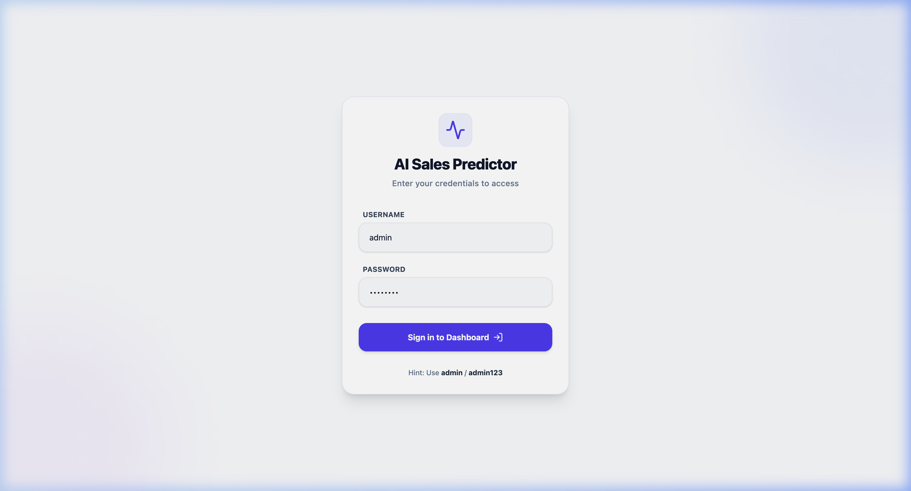
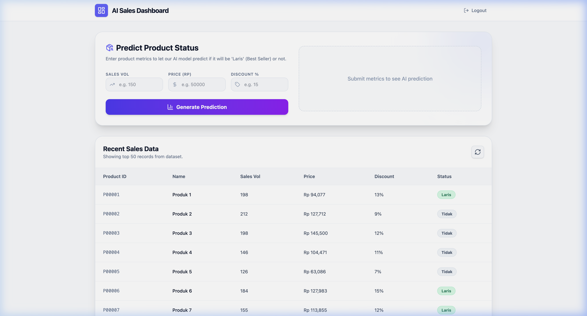

# 🚀 Mini AI Sales Prediction System

A mini application for sales data management and product status prediction (**Best Seller** or **Not Best Seller**) using an integrated Machine Learning model.

---

## 🛠️ Tech Stack
-   **Backend:** Python 3.9+, FastAPI, JWT Authentication, Pydantic, python-dotenv
-   **Frontend:** React 18, Vite, TypeScript, TailwindCSS (Professional Light Theme), Axios
-   **Machine Learning:** Scikit-Learn (Random Forest Classifier), Pandas, NumPy

---

## 📸 Screenshots

### Login Page


### Dashboard Overview


---

## ⚙️ Initial Setup (One-time Setup)

### 1. Backend Setup
```bash
# Create virtual environment
python3 -m venv venv
source venv/bin/activate

# Install dependencies
pip install -r backend/requirements.txt

# Setup Environment (.env)
cp backend/.env.example backend/.env
```
*Ensure the configurations in `backend/.env` are correct (especially `SECRET_KEY`).*

### 2. Frontend Setup
```bash
cd frontend

# Install dependencies
npm install

# Setup Environment (.env)
cp .env.example .env
```

---

## 🏃 How to Run the Project

### Step 1: Prepare Dataset & Model (ML)
Note: The model must be trained before the backend is started.
```bash
# (Use terminal with active venv)
# Train model based on CSV data (Required)
python ml/model.py
```

### Step 2: Run Backend API
Open a new terminal:
```bash
source venv/bin/activate
# You can run using the wrapper or direct uvicorn
python backend/main.py 
# OR
uvicorn backend.app.main:app --reload --port 8000
```
*API Documentation (Swagger) is accessible at: `http://localhost:8000/docs`*

### Step 3: Run Frontend Dashboard
Open another new terminal:
```bash
cd frontend
npm run dev
```
*Access the UI at: `http://localhost:5173`*

---

## 🔑 Default Login Account
Use the following admin credentials to enter the dashboard:
- **Username:** `admin` *(see .env)*
- **Password:** `admin123` *(see .env)*

---

## 🏗️ Folder Structure
- `/backend`: Core API, Security, and Business Logic.
- `/frontend`: Dashboard UI with feature-based architecture.
- `/ml`: Contains `model.py` (Training script).
- `/data`: Location of the dataset `sales_data.csv`.

---

## ✅ Technical Requirements Compliance
- [x] **Scalable Architecture:** Uses feature-based folder structure (FE) and Clean Architecture (BE).
- [x] **Strict Typing:** No usage of `any` (TS) or `Any` (Python) in core code.
- [x] **Security:** JWT Authentication, password hashing, and `.env` management.
- [x] **ML Integration:** Uses Scikit-Learn (Random Forest) with measured accuracy.
# mini-app-sales-prediction
